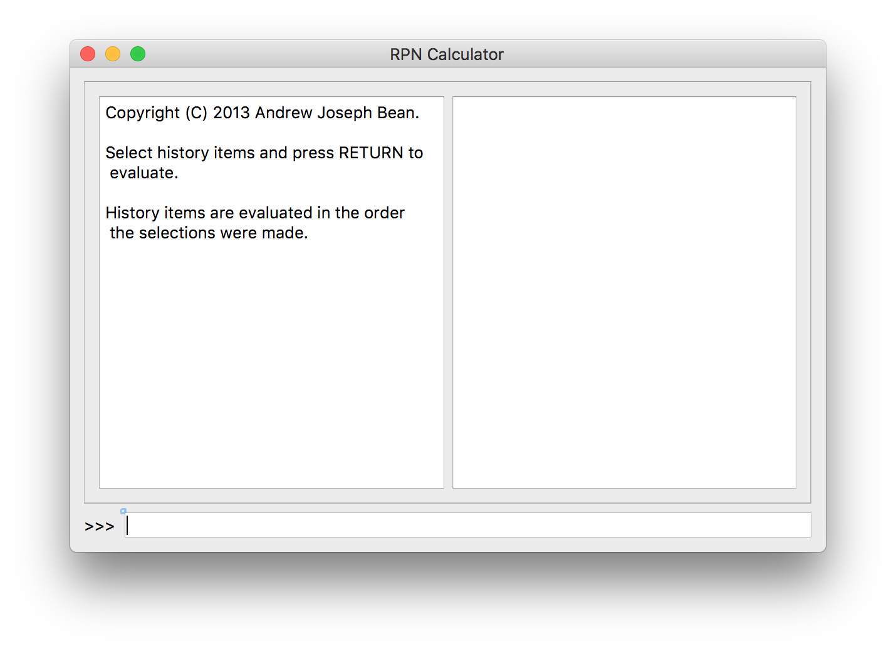

# RPN_Calculator
This is a reverse Polish calculator in C++ and Qt

Some of this code is pretty old, in my opinion. Also, it was only written for my own use, with no focus on collaboration with other coders. The code in rpn.h and rpn.cpp is fairly encapsulated and easy to integrate with other projects. This compiles on my MacBook Pro. I don't know whether it would compile on other systems, or what it would take to make it compile. I suspect very little would be required.
